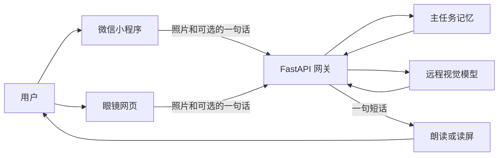
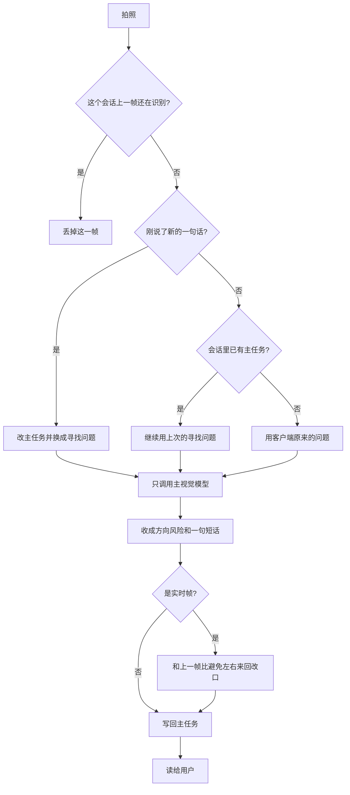
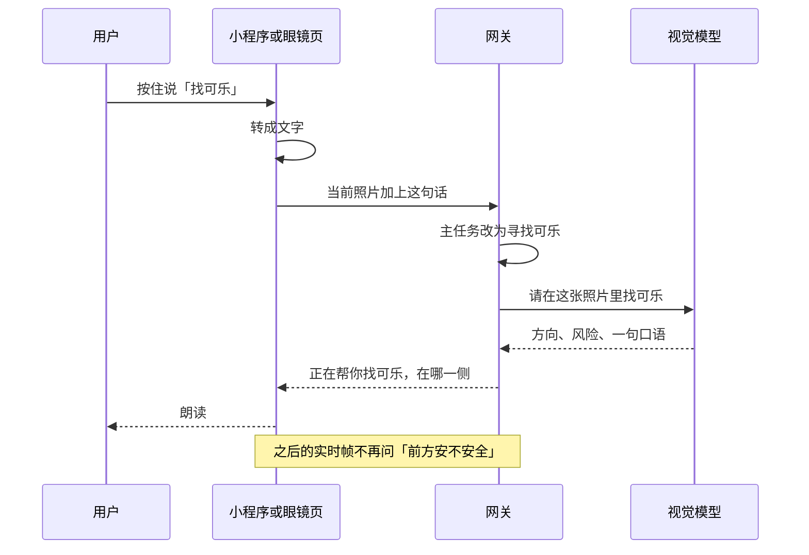

# 看见下一步

面向盲人和低视力用户。手机或眼镜拍到眼前的一帧，系统说下一句该怎么办：在哪一侧、近不近、要不要先停下。它不替代导盲杖，不判断能不能过马路，不对用户报米数。

没有眼镜时用微信小程序。有眼镜时用眼镜网页，镜头跟着视线，手可以拿东西。两边的识别都走同一套云端网关。镜框上不跑模型。

`main` 里同时有硬件方案和软件。改代码从 `main` 拉分支，开 Pull Request，仓库主人看过再合并。协作方式见 [CONTRIBUTING.md](CONTRIBUTING.md)。

## 设计

产品要解决的是采集姿势，不是再做一个看图聊天。货架前举着手机，手被占住，镜头也不是眼睛正在看的方向。

所以拆成三层：

| 层 | 负责 | 不负责 |
|---|---|---|
| 小程序 | 零硬件就能用：拍照、按住说话、读屏和震动 | 不把模型密钥放在手机里 |
| 眼镜 | 摄像头放在眼前；电池和重量尽量离开鼻梁 | 不在镜框上跑视觉模型 |
| 网关 | 记住正在找什么，调用远程视觉模型，把回答收成一句短话 | 不保存用户的照片当长期相册 |

给用户听的只有短句。方向用左、左前、正前、右前、右，或未确定。距离只用近、较近、较远这种粗档。风险高时先说「注意」。

明确不做：替代导盲杖或导盲犬；用一帧画面证明通道安全；报「前方 1.2 米」；帮用户决定过马路；把太阳能或走路发电说成续航。

硬件上的设计约束（详细方案在 `hardware/`）：

- 脸上的重量目标不超过 55 克，超过 80 克不能当可戴样机。
- 摄像头在鼻梁附近、接近眼睛高度。胸口摄像头不能当主摄像头。
- 电放在颈后或充电盒，镜身上只留小电池。
- 线被拉一下时，磁吸先松开，镜框不被拽走。
- 摘下来就不要继续对着空场景播报。

视觉模型可以换。现在主模型是小米 MiMo `mimo-v2.5`。换模型只改网关里的 profile，小程序和眼镜页的字段不用改。第二个视觉模型做复核还没接到主路径。测距硬件也还没接上；接口可以收一个读数，只收成远近档。用户重点记在手机或眼镜页本机。云端长期记忆只有填了密钥才写，没填时识别照常进行。

## 总流程



造型页只给人看外观，不进这条链路。

## 一次识别

实时大约 2.5 秒一帧。上一帧还没回来就丢掉这一帧，不排队，避免用户听到的是几秒前的画面。用户点「再看一眼」时走精确确认，只拍一张，这句话要说出来。



## 说话之后怎么找

听和看是分开的。小程序用微信同声传译把话转成文字，转写在手机里完成。眼镜页把录音交给网关的 `/asr`；没配置语音识别时，可以用浏览器自己的语音识别。

文字到了网关之后，先由文本模型判断这句是任务还是闲聊。模型没答出来时才用关键词。闲聊只回一句短话，不看这一帧，也不改掉正在进行的寻找。找东西、指路、看价格、看障碍，以及寻找还没结束的下一帧，才看摄像头。

任务句再在四件事里选一件：

| 判定 | 含义 |
|---|---|
| new | 还没有主任务，或这是一件新的事 |
| keep | 没有新意图，沿用上一句 |
| refine | 还是同一件事，补充了名字，例如把「可乐」收成「冰可乐」 |
| switch | 目的变了，例如从找可乐改成找门口 |

然后每一帧都用这条寻找问题，直到用户改口或这条记忆过期。过期时间是 30 分钟。这样避免已经出现过的失败：系统只说「记下了」，下一帧却仍在报「前方安不安全」。



## 技术结构

```text
software/miniprogram/     微信小程序
software/server/          FastAPI 网关、眼镜页、测试
software/docs/            软件技术文档 v1.7
hardware/                 眼镜方案、策划案、上机检查
```

网关在 `software/server/server.py`。

| 方法 | 路径 | 作用 |
|---|---|---|
| GET | `/health` | 进程是否活着。不需要口令 |
| GET | `/models` | 现在有哪些模型配置 |
| POST | `/infer` | 上传一张图，返回结构化结果和要念的句子 |
| POST | `/tts` | 把一句短话合成 mp3 |
| POST | `/asr` | 眼镜页上传音频。没配置时返回 501 |
| GET | `/glasses/` | 眼镜识别页。`/glasses/look.html` 是造型页 |

口令放在请求头 `X-App-Token`，和服务器环境变量 `APP_TOKEN` 一致。图片只接受 jpg、png、webp，默认最大 5 MB。口令不对是 401，图太大是 413，上一帧还在识别是 429。

模型配置在 `software/server/model_profiles.json`。密钥只写环境变量名，不写进仓库。当前 `primary` 是 MiMo `mimo-v2.5`，思考关闭。`backup` 还是占位地址。

回答进到用户耳朵之前会先收干净：方向不在允许列表里就变成「未确定」；高风险的句子以「注意」开头；米和步数从句子里拿掉；寻找任务会补上「正在帮你找……」。

`services/fusion.py` 里有第二个视觉模型的融合函数，主路径没有调用。没有 `verify` 配置之前，对外仍是单模型。`tof_mm` 可以收，没有读数就是无法判断，不把毫米念出来。重点记在本机；`MEMOS_API_KEY` 留空时不请求云端记忆。

## 本地运行

```powershell
cd software/server
python -m venv .venv
.\.venv\Scripts\Activate.ps1
python -m pip install -r requirements-server.txt
copy .env.example .env
python server.py --host 127.0.0.1 --port 8000
```

浏览器打开 `http://127.0.0.1:8000/glasses/`。小程序用微信开发者工具打开 `software/miniprogram`，设置页填同一地址和口令。`.env` 不要提交。

部署见 [software/DEPLOY.md](software/DEPLOY.md)。线上网关是 `https://watchapi.divesee.com`。字段和判定的更细说明见 [软件技术文档 v1.7](software/docs/看见下一步_软件技术文档_v1.7.md)。

## 检查

软件测试在 `software/server` 里：

```powershell
python -m unittest discover -s tests -v
```

这 53 项不调用真实模型。它们看口令、丢帧、主任务四种判定、闲聊不改寻找、句子里不出现米、眼镜页文件是否还在。改 `software/server/` 的 Pull Request 会在 GitHub 上跑同一组测试。

硬件样机按 [hardware/tests/bringup-checklist.md](hardware/tests/bringup-checklist.md) 填写记录。没有样机就在 Pull Request 里写「未上机」。真机还要听两件事：说完「找可乐」后下一帧仍在找可乐；高风险先听到「注意」。
