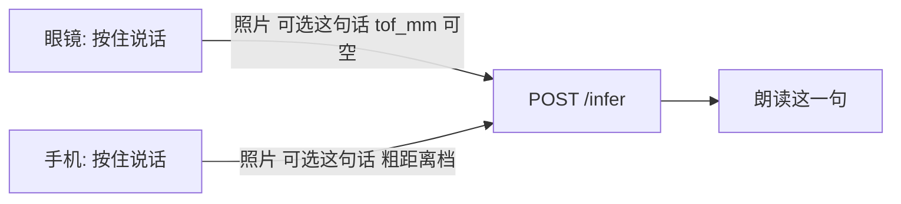
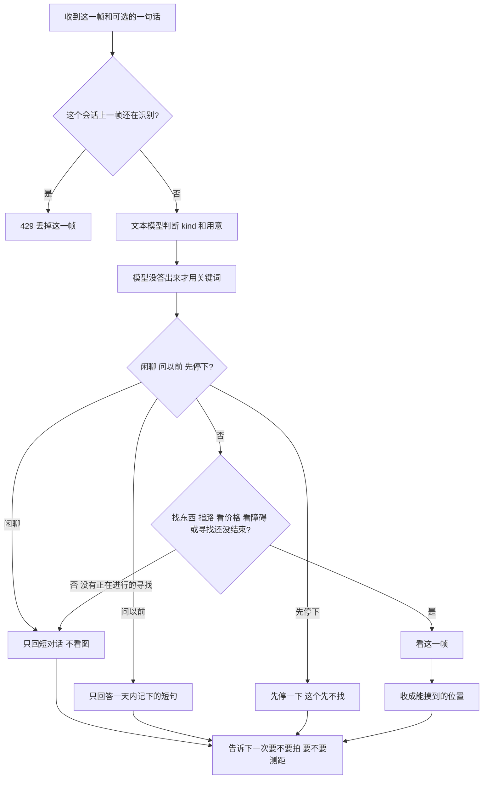
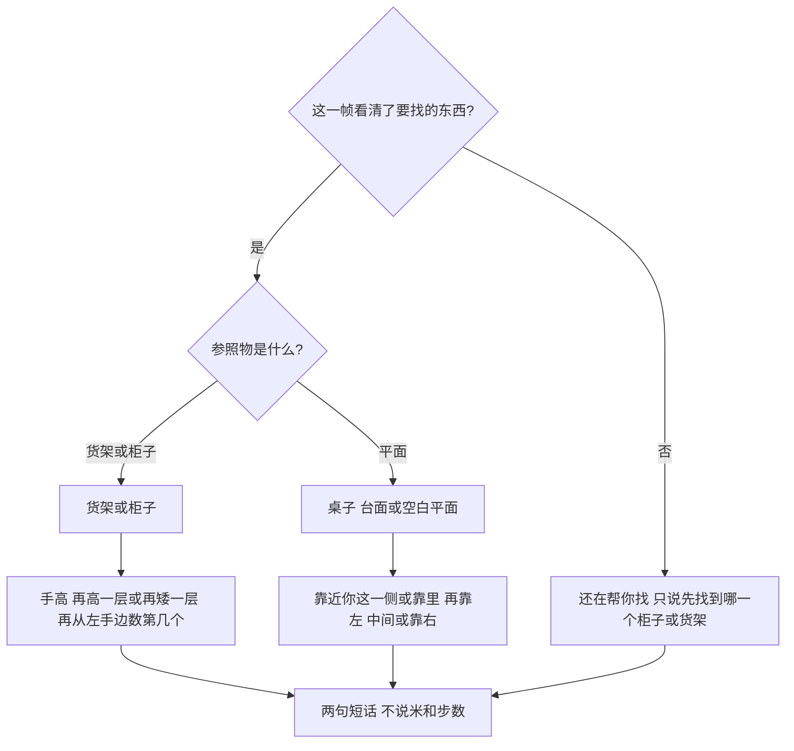
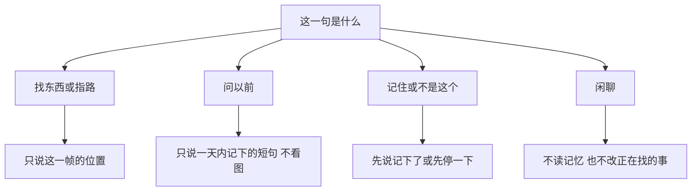

# 看见下一步：当前判定说明

这份说明对应当前代码。`看见下一步_软件技术文档_v1.7.md` 里「用户说完话不再调用对话模型」「长期记忆还没接到请求上」已经过时，以这里为准。

不替代导盲杖，不判断能不能过马路，不对用户说米、厘米或步数。测距硬件没接上。云端 MemOS 只有填了密钥才写；现在默认不写，也不把记下的短句交给出行那一句。

## 1. 两端各做什么

眼镜页只有一个按钮：按住说话。画面不给用户看，镜头只用来取这一帧。松开之后，识别结果用语音说出来。

手机页尽量短：按住说话、刚才那一句、正在找什么。不列出记下的短句，也不把这份记录留在手机存储里。打开页面时会清掉以前留下的 `memoryHighlights`。

两边发给 `/infer` 的字段一致：`session_id`、`user_id`、`mode`、`spoken_text`、`distance_band`、`tof_mm`、`client`。`tof_mm` 没读数就留空。方向只允许：左侧、左前方、正前方、右前方、右侧、未确定。

## 2. 眼镜按钮

按住时如果摄像头还没开，先申请摄像头和麦克风，不等一句开场白结束才开始听。手指已经松开，就不再录这一句，改为开始看眼前。允许权限之后，按住才录音。

松开后：浏览器能做语音识别就在本机转成文字；不能就上传 `/asr`。没配置语音识别时 `/asr` 返回 501，这一句作废，不编造听到的内容。

没有新的话、并且上一次响应里 `sensors.camera` 为假时，实时帧不上传。找东西或指路还没结束时，服务端会让下一帧继续拍。

## 3. 一句请求怎么判定

闲聊不改当前主任务，也不把「今天怎么样」记成要找的东西。关键词只在文本模型没给出 JSON 时使用。

没有新的话时：精确确认或主任务还在，就继续当任务看这一帧；否则不看图。

`tof_mm` 有数字才收成远近档：一臂内、较近、较远。没有读数就是无法判断。播报里不出现毫米。

看图的模型和判断用意的文本模型，现在都是 MiMo `mimo-v2.5`。闲聊只发文字。`CHAT_MODEL_*` 留空时不换另一个模型。备用视觉模型仍是占位，主路径不调用。

## 4. 主任务

按 `session_id` 存在 `task_memory.sqlite`，30 分钟不更新就过期。

| 判定 | 什么时候 |
|---|---|
| new | 还没有主任务，或这是一件新的事 |
| keep | 没有新的任务句，沿用上一句 |
| refine | 还是同一件事，补充了名字 |
| switch | 目的变了 |

找东西、指路、看价格、看障碍会改这条主任务。闲聊传进去的任务句是空的，所以判定成 keep，正在找的东西还在。

## 5. 找东西时怎么说

原点是使用者自己的脸朝向。先说在你哪一侧，再落到一个能摸到的物体。

货架和柜子才数第几个，而且从使用者的左手边数，最多说到第 6 个。数不清就只说靠左、中间或靠右。

桌子、台面、空白平面不数第几个。只说靠近你这一侧还是靠里，以及靠左、中间、靠右。

高风险时这一句以「注意」开头。不说可以过马路，不说可以放下手杖，不说伸出手去抓。

指路不说成正在找东西。例如往右前方走，并先说面前要注意的架子。

## 6. 记忆什么时候进入这句话

记忆不和眼前这一帧编成一句。

记下的只有三类短句：你明确说记住的、新的或换了的寻找、纠正。垫话不记。同一句再说一次只增加使用次数，最多 20 条。超过 24 小时，本机浏览器里的一份和服务器 `highlights.sqlite` 里的一份一起删掉。

问「我上次找的是什么」时，只从还没过期的短句里回答。没有就说还没记下。不把眼前画面接在后面，也不说「根据你的习惯」。

正在找的事是 30 分钟的主任务，不是上面这本记录。手机不展示、不保存这本记录。

云端两个名字留着但默认不调用：`see-next-note` 和 `see-next-task`。没有 `MEMOS_API_KEY` 时不请求外网。

## 7. 这次查过的问题

按住说话时，如果先播完开场白再开始听，手指可能已经松开，这一句会丢。现在先记住手指还按着没有；摄像头打开时手指已松开，就不再录空的一句，改为开始看眼前。

位置说法以前容易变成「货架中部」。空白平面上没有可数的格子，现在不会再说第几个。
