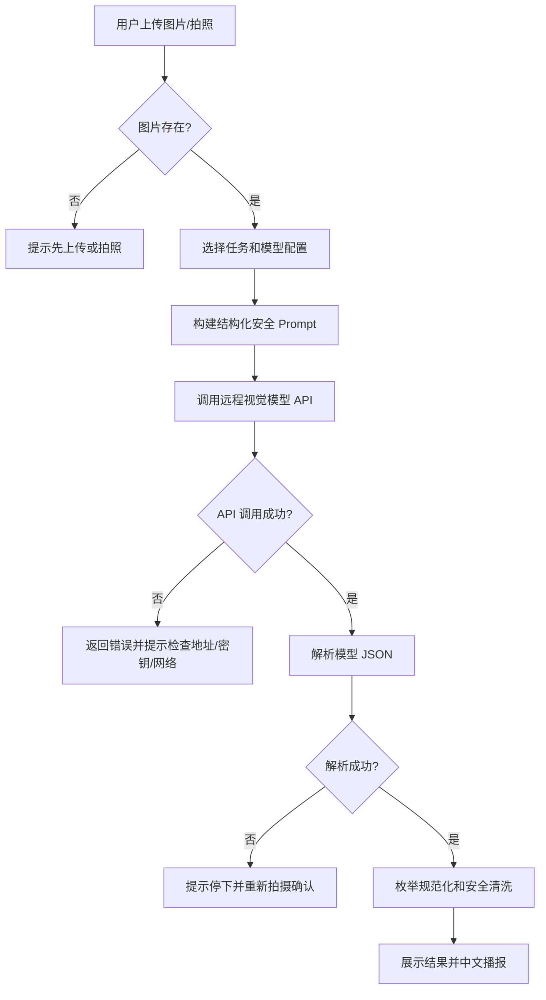
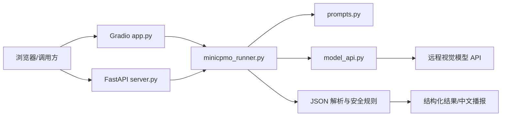

# “看见下一步”W1 Specs 需求规格说明书

| 项目 | 内容 |
|---|---|
| 文档编号 | KNXB-W1-SPEC-001 |
| 赛段 | W1 Specs：问题定义与规格质量 |
| 项目名称 | 看见下一步——视障人群多模态行动辅助助手 |
| 文档版本 | v1.0 |
| 文档状态 | W1 基线回补稿 / 可评审 |
| 编制日期 | 2026-08-02 |
| 规格依据 | 项目策划案、当前远程 API 版程序、安全规则与测试代码 |

---

## 1. 文档目的

本文件用于定义“看见下一步”在 W1 阶段应解决的问题、用户范围、输入输出、功能需求、核心业务规则、安全边界和可执行验收标准。

本文件是从当前 W3 原型向前追溯形成的 W1 规格基线。为避免用后续实现反向拔高早期规格，W1 只要求证明以下最小闭环成立：

```text
图片/摄像头拍照 + 用户任务
        ↓
视觉模型理解画面
        ↓
结构化方向、目标、风险和文字信息
        ↓
安全规则清洗
        ↓
简短行动提示 + 中文语音播报
```

W1 不要求多 Agent、连续视频导航、精确测距、移动端原生 App、历史任务持久化或医疗辅助能力已经实现。

---

## 2. 问题定义与应用价值

### 2.1 目标用户

主要用户包括：

1. 全盲和低视力用户。
2. 老年视觉能力下降人群。
3. 临时视觉受限人群。
4. 在购物、找入口、找服务台或室内通行时需要环境辅助的人群。
5. 陪护人员、无障碍服务人员和辅助技术测试人员。

### 2.2 核心痛点

普通图像描述通常回答“画面中有什么”，但视障用户更需要回答：

- 当前画面是否存在明显风险；
- 目标位于左侧、正前方还是右侧；
- 是否已经接近目标；
- 商品、价格、入口或收银台是否能够确认；
- 下一步应停下、重新拍摄、缓慢确认还是寻求人工帮助；
- 在模型不确定时，系统能否明确承认“不确定”，而不是猜测。

### 2.3 产品定位

“看见下一步”定位为：

> 将多模态模型看到的环境信息，转化为视障用户能够理解和谨慎执行的下一步行动提示。

产品不是连续导航系统，也不是专业避障设备。它通过单张图片或摄像头拍照完成一次环境判断，并通过安全规则降低模型过度承诺带来的风险。

### 2.4 预期价值

| 价值 | 可测量指标 |
|---|---|
| 降低环境理解门槛 | 用户是否能通过一次拍照获得目标、方向、风险和行动提示 |
| 提高信息行动性 | 输出是否包含明确方向、风险等级和下一步建议 |
| 降低不确定场景误导 | 方向无法确认时是否统一降级为“未确定”并提示重新拍摄 |
| 提高风险信息优先级 | 高风险结果是否以警告或停下提示开头 |
| 降低部署成本 | 软件是否不依赖本地模型权重、GPU、NPU 或专用硬件 |
| 支持模型替换 | 是否能通过配置切换兼容的远程视觉模型 |

---

## 3. 核心使用场景

| 场景编号 | 场景 | 用户问题示例 | 预期核心输出 |
|---|---|---|---|
| SC-01 | 找入口 | “入口在哪个方向？” | 入口目标、粗粒度方向、附近风险、谨慎行动建议 |
| SC-02 | 找商品 | “请帮我找矿泉水。” | 商品是否可确认、方向、货架信息、置信度 |
| SC-03 | 识别价格 | “这个商品多少钱？” | 可见商品名和价格文字；不确定时不猜测 |
| SC-04 | 找收银台 | “收银台在哪里？” | 收银台方向、通道障碍、停下或缓慢确认提示 |
| SC-05 | 障碍提醒 | “前面安全吗？” | 台阶、玻璃门、车辆、行人或地面障碍及风险等级 |
| SC-06 | 一般辅助 | 自定义环境问题 | 在安全边界内给出结构化环境辅助信息 |

---

## 4. 输入、输出与接口契约

### 4.1 输入定义

| 输入 | 类型 | 必填 | 规格 |
|---|---|---:|---|
| 环境图片 | JPG、JPEG、PNG 等常见图片 | 是 | 来自上传文件或摄像头拍照；应能被模型 API 识别 |
| 用户问题 | 中文文本 | 是 | 默认问题为“请判断当前是否安全，并告诉我目标在哪个方向” |
| 任务类型 | 枚举/文本 | 否 | 找入口、找商品、识别价格、找收银台、障碍提醒 |
| 模型配置 | profile 名称 | 否 | 不传时使用默认模型配置 |
| 模型 ID 覆盖 | 字符串 | 否 | 临时覆盖所选配置中的默认模型 ID |

输入失败时必须给出可理解提示：

- 未提供图片：提示用户上传图片或拍照；
- 图片路径不存在：返回图片不存在错误；
- 模型配置不存在：返回可选配置列表；
- API 地址、密钥或网络错误：返回远程模型调用失败，不得伪造结果；
- 模型不支持视觉输入：作为模型服务错误处理。

### 4.2 结构化输出定义

模型结果经过解析和安全规范化后，应满足以下字段契约：

```json
{
  "intent": "find_entrance",
  "scene": "便利店入口区域",
  "target": "入口",
  "direction": "右前方",
  "proximity": "无法判断",
  "text_reading": "",
  "obstacles": ["展示架"],
  "risk_level": "medium",
  "confidence": "medium",
  "action": "请先停下确认通道，再缓慢靠近。",
  "speech": "注意前方有展示架。入口在右前方，请先停下确认。"
}
```

### 4.3 枚举约束

| 字段 | 允许值 |
|---|---|
| `intent` | `find_entrance`、`find_product`、`read_price`、`find_cashier`、`avoid_obstacle`、`general_help` |
| `direction` | 左侧、左前方、正前方、右前方、右侧、未确定 |
| `proximity` | 较近、较远、已接近、无法判断 |
| `risk_level` | `low`、`medium`、`high` |
| `confidence` | `low`、`medium`、`high` |

### 4.4 展示输出

用户界面至少展示：

1. 下一步行动提示；
2. 安全等级；
3. 目标方向；
4. 接近状态；
5. 识别到的文字或价格；
6. 障碍与风险元素；
7. 场景、目标和置信度；
8. 调用状态、模型配置、模型 ID 和请求耗时；
9. 规范化 JSON 与模型原始输出；
10. 中文语音播报、重新播报和立即停止。

---

## 5. 功能需求

| 编号 | 功能需求 | 优先级 | W1 验收口径 |
|---|---|---:|---|
| FR-001 | 图片上传与摄像头拍照 | P0 | 用户能提供一张环境图片；无图片时不调用模型 |
| FR-002 | 任务选择与问题编辑 | P0 | 预置五类任务，问题文本允许修改 |
| FR-003 | 多模态视觉推理 | P0 | 图片和问题被发送给支持视觉输入的模型接口 |
| FR-004 | 模型 API 解耦 | P0 | 软件不依赖本地模型权重，可通过 API 地址、模型 ID 和密钥配置运行 |
| FR-005 | 多模型配置 | P1 | 可配置主模型和备用模型，并能在界面或 API 中选择 |
| FR-006 | JSON 解析 | P0 | 能解析普通 JSON 或 Markdown JSON 代码块 |
| FR-007 | 结果规范化 | P0 | 非法 intent、方向、风险、置信度和接近状态被转换为安全默认值 |
| FR-008 | 风险优先 | P0 | `high` 风险播报以“注意”类警告开头 |
| FR-009 | 不确定性降级 | P0 | 非法或无法确认的方向统一为“未确定”，提示停下并重新拍摄 |
| FR-010 | 精确行动清洗 | P0 | 移除未经验证的米数、厘米、步数、角度和伸手抓取指令 |
| FR-011 | Web 交互与播报 | P0 | 页面展示结构化结果并使用浏览器中文 TTS 播报 |
| FR-012 | 软件业务 API | P1 | 提供 `/health`、`/models` 和 `/infer` |
| FR-013 | Mock 模式 | P1 | 不调用模型即可验证界面、端口和输出结构 |
| FR-014 | 批量评测 | P1 | 能依据固定场景清单生成评测结果文件 |
| FR-015 | 自动测试 | P1 | JSON、安全清洗、模型请求体和配置路由具备离线测试 |

---

## 6. 核心业务逻辑

### 6.1 主流程



### 6.2 安全规则

| 规则编号 | 条件 | 系统动作 |
|---|---|---|
| SR-001 | `direction` 不在允许集合 | 转为“未确定”；置信度转为 `low` |
| SR-002 | 方向为“未确定” | action 和 speech 改为“请停下并重新拍摄确认” |
| SR-003 | `risk_level=high` | action 和 speech 前置高风险警告 |
| SR-004 | 出现米、厘米、步、角度等精确引导 | 替换为“无法准确判断的距离”等谨慎表达 |
| SR-005 | 出现“可以直接前进” | 改为使用辅助工具确认后再移动 |
| SR-006 | 出现“伸出左/右手” | 改为接近后重新拍摄确认目标位置 |
| SR-007 | 模型输出不是合法 JSON | 不将原始文本直接作为行动指令播报 |
| SR-008 | API 调用失败 | 返回错误状态，不生成虚假环境结论 |

### 6.3 模型选择逻辑

1. 优先使用请求指定的 `model_profile`；
2. 未指定时使用 `default_profile`；
3. 如传入临时模型 ID，则覆盖所选 profile 的默认模型；
4. API 密钥从服务器环境变量读取；
5. 模型配置不存在时拒绝调用并返回错误；
6. 不在客户端页面展示完整密钥。

---

## 7. 非功能需求

| 编号 | 非功能要求 | 验收方法 |
|---|---|---|
| NFR-001 | 可复现性 | README 给出安装、配置、启动、测试和 API 调用命令 |
| NFR-002 | 可替换性 | 切换配置文件中的 API 地址和模型 ID 不需要修改业务代码 |
| NFR-003 | 可维护性 | UI、业务规则、模型网关、Prompt 和 API 服务分文件组织 |
| NFR-004 | 安全性 | 密钥不进入 Git、页面返回值或健康检查明文 |
| NFR-005 | 可观察性 | 返回状态、模型配置、模型 ID、错误和耗时 |
| NFR-006 | 可访问性 | 关键结果大字号展示并支持中文语音播报和立即停止 |
| NFR-007 | 兼容性 | 支持 OpenAI 风格的多模态 Chat Completions 接口 |
| NFR-008 | 失败可理解 | 配置、文件、网络、HTTP、超时和 JSON 错误具有明确状态 |
| NFR-009 | 隐私最小化 | 临时上传文件在业务 API 请求结束后删除 |
| NFR-010 | 测试隔离 | 单元测试不访问外网、不要求真实模型密钥 |

---

## 8. 技术架构与可行性



技术可行性依据：

- 远程模型采用标准 HTTP JSON 请求，无需本地模型运行时；
- 图片通过 Base64 Data URI 发送，兼容常见视觉模型接口；
- 业务规则在本地确定性执行，不完全依赖模型自律；
- Mock 模式允许在无网络、无密钥情况下验证产品交互；
- FastAPI 和 Gradio 分别满足程序调用和现场演示需要。

---

## 9. 适用边界与诚实披露

### 9.1 明确不提供

- 不提供连续实时导航；
- 不承诺精确距离、步数和转向角度；
- 不替代导盲杖、导盲犬、无障碍设施或人工协助；
- 不保证模型对玻璃门、车辆、台阶和遮挡目标始终识别正确；
- 不提供道路穿越决策；
- 不提供医疗诊断、治疗建议或紧急救援；
- 不在 W1 声称语音输入、震动反馈、历史记录和多轮记忆已经完成。

### 9.2 运行依赖

- 需要 Python 和 Web 依赖；
- 真实推理需要可访问的视觉模型 API；
- 需要有效 API 地址、模型 ID 和密钥；
- 远程服务的速度、限流、计费和隐私政策不由本软件控制。

---

## 10. W1 可执行验收用例

| 用例 | 输入/操作 | 通过条件 | 证据 |
|---|---|---|---|
| W1-AT-001 | 不上传图片，点击识别 | 不调用模型；提示先上传或拍照 | 页面录屏/函数返回 |
| W1-AT-002 | 上传图片并选择“找入口” | 问题自动切换为入口任务模板 | 页面截图 |
| W1-AT-003 | 提供合法结构化模型结果 | 输出包含 11 个规定字段 | JSON 结果 |
| W1-AT-004 | 模型返回 Markdown JSON 代码块 | 能提取并解析 JSON | 单元测试 |
| W1-AT-005 | 模型返回非法方向“身后” | 方向变为“未确定”，提示重新拍摄 | 单元测试 |
| W1-AT-006 | 模型建议“两米、三步、30 度” | 精确距离、步数和角度被清洗 | 单元测试 |
| W1-AT-007 | 模型返回高风险 | 播报以风险警告开头 | 单元测试 |
| W1-AT-008 | 配置两个模型 profile | `/models` 返回两个配置，页面可选择 | API 响应/截图 |
| W1-AT-009 | 临时传入其他模型 ID | 请求体使用临时模型 ID | 模拟请求测试 |
| W1-AT-010 | 模型 API 无法连接 | 返回 error，不生成伪造识别结果 | 错误日志/API 响应 |
| W1-AT-011 | 启动 Mock 模式 | 无本地模型和密钥仍可完成页面演示 | 启动记录 |
| W1-AT-012 | 调用 `/infer` | 返回状态、结果、原始输出、耗时、profile 和模型 ID | 接口响应 |

建议 W1 通过条件：

- 12 项验收中 P0 项全部通过；
- 安全规则 SR-001 至 SR-008 有明确测试或复现步骤；
- 文档、代码和页面对能力边界的描述一致；
- 不把 Mock 输出或计划能力表述为真实模型效果。

---

## 11. W1 评分表（100 分）

| 维度 | 分值 | 本项目满分证据 |
|---|---:|---|
| 问题定义与应用价值 | 15 | 用户、五类核心场景、行动化差异和社会价值明确 |
| 输入、输出与适用边界 | 10 | 图片/问题/模型配置输入及 11 字段输出契约完整 |
| 功能需求完整性 | 20 | 图像输入、API 调用、解析、安全、展示、播报和接口形成闭环 |
| 核心业务逻辑 | 20 | 模型路由、失败路径、枚举规范化和安全清洗可执行 |
| 可执行评测标准 | 25 | 统一验收用例、通过条件、证据位置和失败判定清楚 |
| 技术可行性与诚实披露 | 10 | 远程 API 架构可行，已实现和未实现能力明确分开 |
| **合计** | **100** |  |

### W1 限制项

出现以下情况时，W1 不建议判为优秀：

1. 未定义结构化输出字段或允许值；
2. 未定义方向不确定和高风险时的处理；
3. 把精确距离或“可以直接前进”作为可靠承诺；
4. 将单张图片能力宣传为实时连续导航；
5. 未说明远程模型依赖、网络风险和隐私边界；
6. 验收标准只有“效果好”“回答正确”等不可执行描述。

---

## 12. W1 交付清单

- 本需求规格说明书；
- 原始项目策划案；
- 输入输出 JSON 示例；
- 12 项验收用例；
- 系统架构图与安全规则表；
- W2 原型实现的需求追踪入口。

---

## 13. W1 结论

W1 阶段的核心结论是：项目问题真实，用户和场景明确，输入输出可结构化，核心风险可通过确定性规则约束，并能以远程视觉模型 API 完成低成本原型。后续阶段必须继续证明这些规格不是文档承诺，而是可运行、可测试和可复现的产品行为。