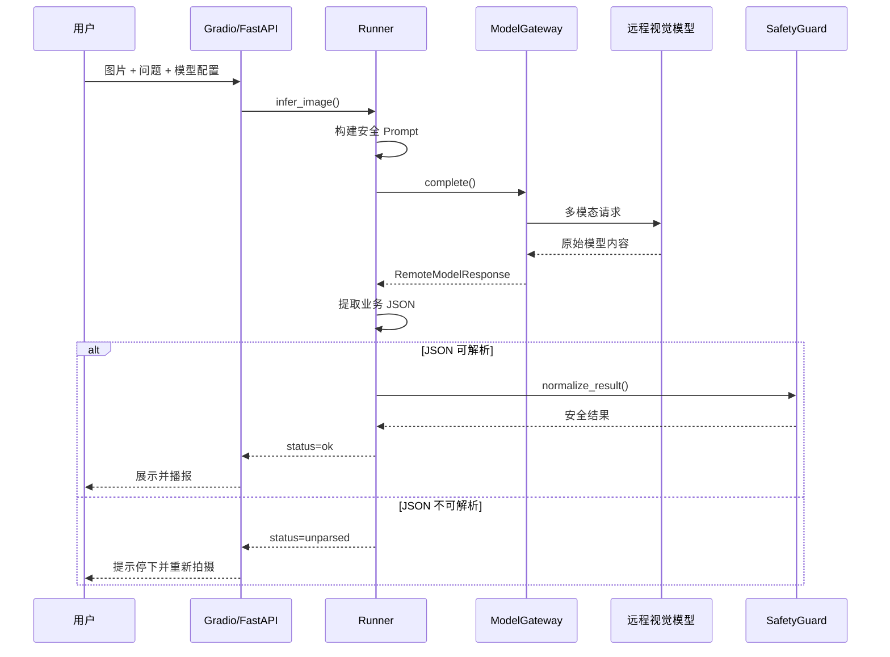

# “看见下一步”W2 Skills + Prototype 参赛文档

| 项目 | 内容 |
|---|---|
| 文档编号 | KNXB-W2-SUBMISSION-001 |
| 赛段 | W2 Skills + Prototype |
| 项目名称 | 看见下一步——视障人群多模态行动辅助助手 |
| 文档版本 | v2.0 |
| 文档性质 | 参赛提交材料 |
| 更新日期 | 2026-08-03 |
| 前置材料 | 《看见下一步 W1 Specs 需求规格说明书》 |

---

## 1. 项目概述

“看见下一步”是一款面向视障、低视力和视觉能力受限人群的多模态行动辅助应用。用户通过上传环境图片或使用摄像头拍照，并输入“入口在哪里”“请帮我找商品”“收银台在哪个方向”等问题，系统调用远程视觉模型理解画面，再将模型结果转换为结构化的目标、方向、风险、文字识别和下一步行动提示。

本项目与普通画面描述工具的差异在于：不仅回答“画面里有什么”，还尝试回答“当前需要注意什么、目标在哪个方向、下一步应该停下还是重新确认”。

W2 阶段完成了从需求规格到可运行 Prototype 的转化，形成了以下闭环：

```text
图片/摄像头 + 用户任务
        ↓
远程多模态模型 API
        ↓
结构化 JSON 提取
        ↓
方向、风险和置信度规范化
        ↓
安全语言清洗
        ↓
页面结果 + 中文语音播报 + FastAPI 输出
```

---

## 2. W2 阶段成果

本阶段已经完成：

- Gradio 产品页面；
- 图片上传和浏览器摄像头拍照；
- 找入口、找商品、识别价格、找收银台、障碍提醒五类任务；
- 用户问题自由编辑；
- OpenAI 兼容的远程多模态模型接口；
- 主模型和备用模型配置；
- 页面选择模型 profile；
- 临时覆盖模型 ID；
- 模型原始输出的 JSON 提取；
- 结构化字段规范化；
- 高风险优先提示；
- 不确定方向安全降级；
- 米数、步数、角度和绝对安全承诺清洗；
- 浏览器中文语音播报、重新播报和停止；
- FastAPI 服务；
- Mock 演示模式；
- 批量场景评测入口；
- 10 项离线单元测试；
- Windows 和 Linux 启动说明。

软件本体不再要求部署 MiniCPM-o 或其他本地模型权重，也不依赖 Torch、CUDA、NPU 或 llama.cpp。真实推理由外部视觉模型 API 提供，业务逻辑、安全规则和交互界面保持独立。

---

## 3. Skills 完整性

当前 Prototype 将核心能力划分为六个可以明确定位、独立解释和分别验证的 Skills。当前代码采用 Python 模块、类和函数实现这些能力，没有把普通函数虚构成多个 Agent。

### 3.1 输入与任务理解 Skill

**目标**：接收用户图片、任务、问题和模型选项，形成一次完整任务上下文。

**输入**：

- 图片路径；
- 用户问题；
- 任务类型；
- 模型 profile；
- 可选临时模型 ID。

**输出**：

- 可供推理流程使用的请求上下文；
- 或明确的输入错误。

**实现位置**：

- `app.py`
- `server.py`

**实现事实**：

- Gradio 图片组件支持 upload 和 webcam；
- 五类任务可以自动更新默认问题；
- 用户仍可修改问题文本；
- FastAPI `/infer` 接收图片、问题、模型配置和模型 ID；
- 页面未收到图片时不会调用模型；
- API 上传的临时图片在请求结束后删除。

### 3.2 Prompt 与结构化 Schema Skill

**目标**：把用户问题转化为包含业务目标、安全边界和输出字段约束的模型 Prompt。

**实现位置**：

- `prompts.py`

**主要能力**：

- 规定 intent、scene、target、direction、proximity、text_reading、obstacles、risk_level、confidence、action、speech 等字段；
- 规定合法方向和风险枚举；
- 要求风险信息优先；
- 目标无法确认时必须明确输出“未确定”；
- 禁止猜测不可见文字；
- 禁止将未经验证的精确距离、步数和角度作为可靠引导；
- 用户的真实问题会进入 Prompt，不使用固定示例替代。

### 3.3 模型路由与远程 API Skill

**目标**：让同一套软件能够接入和切换不同的视觉模型。

**实现位置**：

- `model_api.py`
- `model_profiles.json`

**核心类型**：

- `ModelProfile`
- `RemoteModelResponse`
- `OpenAICompatibleVisionClient`
- `ModelGateway`

**实现能力**：

1. 从 JSON 配置文件加载多个模型 profile；
2. 使用环境变量覆盖 API 地址、模型 ID 和超时；
3. 从 profile 指定的环境变量读取 API Key；
4. 根据页面或 API 参数选择 profile；
5. 使用临时模型 ID 覆盖默认模型；
6. 自动判断图片 MIME 类型；
7. 将图片转换为 Base64 Data URI；
8. 调用 OpenAI 风格的 `/chat/completions`；
9. 解析 `choices[0].message.content`；
10. 记录实际 profile、模型 ID、响应 ID、usage 和错误。

API Key 不会通过 `/health`、`/models` 或页面返回。公共状态只显示密钥是否已配置。

### 3.4 结构化结果解析 Skill

**目标**：把模型的文本结果转换为可继续处理的业务对象。

**实现位置**：

- `try_parse_json()`
- `minicpmo_runner.py`

**实现能力**：

- 解析普通 JSON；
- 解析 Markdown JSON 代码块；
- 从前后包含解释文字的回答中提取最外层 JSON 对象；
- 拒绝非对象 JSON；
- 解析失败时返回 `None`，进入 `unparsed` 路径；
- 保留模型原始回答，便于调试和复核。

### 3.5 安全规范化与行动守卫 Skill

**目标**：在模型输出与用户之间增加确定性的安全控制层。

**实现位置**：

- `normalize_result()`
- `sanitize_guidance()`
- `minicpmo_runner.py`

**主要规则**：

| 条件 | 处理方式 |
|---|---|
| intent 不合法 | 转为 `general_help` |
| 方向不合法 | 转为“未确定” |
| 风险等级不合法 | 转为 `medium` |
| 置信度不合法 | 转为 `low` |
| 接近状态不合法 | 转为“无法判断” |
| 方向为“未确定” | 强制提示停下并重新拍摄确认 |
| 风险等级为 `high` | 在 speech 和 action 前加入风险警告 |
| 出现米、厘米、步或角度 | 替换为谨慎的非精确表达 |
| 出现“可以直接前进” | 改为使用辅助工具确认后再移动 |
| 出现伸手抓取指令 | 改为接近后重新拍摄确认 |

安全规则在本地代码中执行，不完全依赖模型遵守 Prompt。

### 3.6 输出交互与质量验证 Skill

**目标**：把规范化结果交付给用户、外部调用方和测试流程。

**实现位置**：

- `app.py`
- `server.py`
- `benchmark.py`

**页面输出**：

- 下一步行动提示；
- 安全等级；
- 目标方向；
- 接近状态；
- OCR/价格文字；
- 障碍列表；
- 场景、目标和置信度；
- profile、模型 ID 和耗时；
- 规范化 JSON 与原始输出。

**程序接口**：

- `GET /health`
- `GET /models`
- `POST /infer`

**辅助验证**：

- 浏览器中文 SpeechSynthesis；
- 重新播报和立即停止；
- benchmark 场景批量运行；
- JSON 解析率和安全语言通过率统计。

---

## 4. Skills 独立性与接口契约

### 4.1 模型配置对象

```text
ModelProfile
  name
  label
  provider
  base_url
  model
  api_key_env
  timeout
  max_tokens
  temperature
  headers
  extra_body
```

模型配置与业务逻辑分离。更换模型服务时，通常只需要修改 `model_profiles.json` 或环境变量，不需要修改页面和安全规则。

### 4.2 模型响应对象

```text
RemoteModelResponse
  text
  profile
  model
  response_id
  usage
```

该对象只表示外部模型调用结果，不负责业务安全判断。

### 4.3 业务结果对象

```text
InferenceResult
  answer
  parsed
  raw_answer
  status
  error
  latency_ms
  load_time_ms
  profile
  model
  usage
```

`InferenceResult` 统一承载正常、未解析和错误状态，使 Gradio 与 FastAPI 使用相同的业务结果。

### 4.4 模块边界

| 模块 | 不承担的责任 |
|---|---|
| Gradio 页面 | 不直接拼装模型 HTTP 请求，不保存真实密钥 |
| FastAPI | 不直接解析模型结果，不重复实现安全规则 |
| Model Gateway | 不决定方向是否合法，不生成最终行动提示 |
| JSON 解析 | 不调用模型，不控制页面 |
| Safety Guard | 不读取图片，不处理网络请求 |
| Browser TTS | 只播报最终结果，不决定内容是否安全 |

---

## 5. 工作流与协同闭环



### 5.1 不同状态的真实处理

| 状态 | 系统行为 |
|---|---|
| 无图片 | 页面提示先上传或拍照 |
| Mock | 跳过模型 API，返回标识明确的演示结果 |
| 正常响应 | 解析、规范化、展示和播报 |
| 业务 JSON 无法解析 | 返回 `unparsed`，不直接播报模型自由文本 |
| 网络或 HTTP 错误 | 返回 `error` 和明确错误信息 |
| 非法方向 | 转为“未确定”并要求重新拍摄 |
| 高风险 | 风险警告位于行动信息之前 |
| 精确或绝对行动指令 | 由本地规则清洗 |

---

## 6. Prototype 产品体验

### 6.1 用户操作流程

1. 打开网页；
2. 上传图片或使用摄像头拍照；
3. 选择任务；
4. 修改或确认问题；
5. 在需要时选择模型 profile；
6. 点击“开始辅助识别”；
7. 收听中文行动提示；
8. 查看风险、方向、文字、障碍和结构化结果；
9. 使用“重新播报”或“立即停止”；
10. 如结果不确定，重新拍摄或寻求人工确认。

### 6.2 无障碍设计考虑

- 行动提示使用较大字号和较高字重；
- 风险区域独立展示；
- 结果以短句式播报；
- 支持语音立即停止；
- 不确定时使用统一、明确的停下提示；
- 页面持续显示产品安全边界；
- 调试 JSON 与用户行动提示分离，避免技术信息干扰主要操作。

### 6.3 多模型体验

网页的“模型 API 选择”区域可以：

- 选择 primary 或 backup；
- 查看配置标签和默认模型 ID；
- 输入临时模型 ID；
- 在不修改业务代码的情况下测试其他兼容视觉模型。

密钥只保留在服务器环境变量中，不要求用户在普通操作页面输入。

---

## 7. 工程质量、异常处理与复现

### 7.1 配置方式

```powershell
$env:MODEL_API_BASE_URL="https://视觉模型服务地址/v1"
$env:MODEL_NAME="视觉模型ID"
$env:MODEL_API_KEY="API密钥"
python app.py
```

多模型配置通过 `model_profiles.json` 管理，支持 profile 专用的地址、模型和密钥环境变量。

### 7.2 已处理异常

- 配置文件不存在时使用环境变量或默认配置；
- profile 不存在时返回可选配置；
- 图片不存在时中止请求；
- HTTP 错误保留状态码和错误正文；
- 网络不可达时返回连接错误；
- 请求超时时返回超时信息；
- API 返回非法 JSON 时返回格式错误；
- API 缺少 `choices[0].message.content` 时返回结构错误；
- 模型业务 JSON 无法解析时进入安全降级；
- FastAPI 临时图片在请求结束后删除。

### 7.3 启动方式

```bash
python -m pip install -r requirements.txt
python app.py --host 0.0.0.0 --port 7860
python server.py --host 0.0.0.0 --port 8000
```

Windows 可使用：

```powershell
.\scripts\run_app.ps1
.\scripts\run_server.ps1
```

无模型密钥时可运行：

```bash
python app.py --mock
```

---

## 8. 有效性与验证证据

当前代码快照已完成以下验证：

- 10 项单元测试通过；
- JSON 代码块解析通过；
- 非法方向安全降级通过；
- 精确距离和步数清洗通过；
- 高风险警告优先通过；
- Mock Schema 完整性通过；
- 模型 Endpoint 拼接通过；
- 完整 Chat Completions 地址保持通过；
- 图片 Data URI 请求结构通过；
- Bearer API Key Header 通过；
- 临时模型 ID 覆盖通过；
- profile 专用密钥环境变量通过；
- Gradio Blocks 构建检查通过；
- FastAPI `/health`、`/models`、Mock `/infer` 冒烟检查通过；
- 系统状态确认 `local_model_required=false`。

测试命令：

```bash
python -m unittest discover -s tests -v
```

当前测试不访问真实模型 API，因此不会消耗模型额度，也不会将密钥写入测试代码。

---

## 9. 现场展示方案

### 9.1 无密钥备份展示

- 运行 Mock 页面；
- 展示上传、任务选择、结构化结果和语音播报；
- 展示 `/health`、`/models` 和 Mock `/infer`；
- 明确标注 Mock 只验证产品链路，不代表真实视觉效果。

### 9.2 真实模型展示

1. 设置 API 地址、模型 ID 和密钥；
2. 使用一张未预运行的现场图片；
3. 选择“找入口”或“障碍提醒”；
4. 完成一次模型调用；
5. 展示模型原始输出；
6. 展示规范化 JSON；
7. 说明哪些安全规则可能修改了模型文字；
8. 播放最终中文行动提示；
9. 切换备用 profile 或临时模型 ID；
10. 展示模型可替换而业务契约保持稳定。

### 9.3 失败路径展示

通过单元测试或受控模拟响应展示：

- 非法方向；
- 高风险结果；
- 精确距离和步数；
- 非法业务 JSON；
- API 网络错误。

---

## 10. 项目创新点

### 10.1 从画面描述到行动提示

系统将画面理解转换为目标、方向、风险和下一步提示，重点服务视障用户的实际行动需求。

### 10.2 模型与软件解耦

产品不绑定单一本地模型。只要服务支持兼容的多模态接口，就可以通过配置切换模型，降低部署成本和硬件门槛。

### 10.3 确定性安全守卫

系统不会直接信任模型最终文本，而是对方向、风险和行动语言进行二次处理。该设计使业务安全边界不完全依赖模型自身表现。

### 10.4 用户结果与调试证据并存

用户看到简短行动提示，开发和评审人员可以同时查看原始输出、结构化结果、模型信息和耗时，便于解释和复现。

---

## 11. 当前限制

当前 Prototype 仍存在以下限制：

- 只处理单张图片，不是连续实时导航；
- 不提供可靠精确距离；
- OCR 和目标识别依赖所选视觉模型；
- 没有麦克风语音识别输入；
- 没有多轮上下文和跨请求记忆；
- 没有任务历史和数据库；
- 没有自动重试、熔断和限流；
- 业务 FastAPI 尚未增加访问鉴权；
- benchmark 已有程序和场景清单，但正式授权图片和真实模型结果仍需补充；
- 当前不是多 Agent 系统；
- 养老和 ADHD 方向尚属于后续规划。

这些限制将在参赛演示和说明材料中明确展示，不使用计划能力替代当前成果。

---

## 12. 从 W2 进入 W3 的工作计划

进入 W3 后，项目重点是补充真实应用证据，而不是仅增加页面功能：

1. 准备五类场景共 10 张授权图片；
2. 固定主模型、备用模型和参数版本；
3. 运行 benchmark；
4. 保存原图、原始模型输出、规范化结果和耗时；
5. 完成人工方向、OCR、风险和语言安全核对；
6. 演练网络、超时、非法 JSON 和不确定方向；
7. 录制完整现场演示备份；
8. 检查压缩包和日志中不存在真实 API Key；
9. 增加更清晰的安全规则修改说明；
10. 根据真实用户反馈优化播报长度和交互顺序。

---

## 13. W2 阶段总结

W2 阶段已经完成从需求规格到可运行 Prototype 的转换。六项核心 Skills 均能在代码中找到真实实现和输入输出关系；Gradio、FastAPI、模型网关、安全规则和测试使用同一业务链路；软件也已经从本地模型部署中独立出来。

当前成果能够证明工程闭环成立。下一阶段将通过真实图片、真实模型结果、人工核对和完整演示，进一步证明产品在实际场景中的有效性与可靠性。