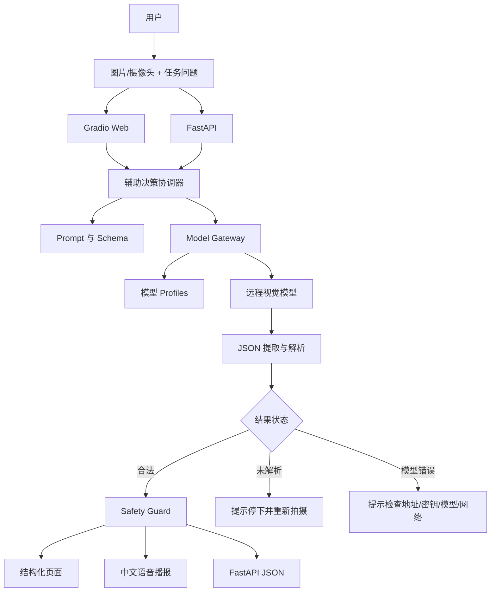

# “看见下一步”W3 半决赛参赛文档

| 项目 | 内容 |
|---|---|
| 文档编号 | KNXB-W3-SUBMISSION-001 |
| 赛段 | W3 半决赛 |
| 项目名称 | 看见下一步——视障人群多模态行动辅助助手 |
| 文档版本 | v2.0 |
| 文档性质 | 半决赛参赛提交材料 |
| 更新日期 | 2026-08-03 |
| 当前产品形态 | 单张图片驱动的多模态辅助决策应用；远程视觉模型 API 版 |

---

## 1. 项目摘要

“看见下一步”面向视障、低视力、老年视觉能力下降和临时视觉受限人群。用户上传当前环境图片或使用摄像头拍照，并提出“入口在哪里”“帮我找矿泉水”“收银台在哪个方向”“前方是否有障碍”等问题。系统通过远程视觉模型理解画面，再将结果转化为简短的方向、风险、文字识别和下一步行动提示，并通过浏览器进行中文语音播报。

项目的核心价值不是增加一项普通图像描述功能，而是补上从“AI 看见”到“用户能够谨慎行动”的最后一环。

当前系统已经形成完整应用链路：

```text
环境图片 + 用户任务
        ↓
可配置远程视觉模型
        ↓
结构化场景理解
        ↓
本地安全规则与不确定性处理
        ↓
行动提示、风险、方向、OCR 和语音播报
```

---

## 2. 真实场景与应用价值

### 2.1 目标用户

- 全盲用户；
- 低视力用户；
- 老年视觉能力下降人群；
- 临时视觉受限人群；
- 需要完成购物、找入口、找服务台和室内通行任务的人群。

### 2.2 核心场景

| 场景 | 用户问题 | 系统提供的信息 |
|---|---|---|
| 找入口 | “入口在哪个方向？” | 目标是否可确认、粗粒度方向、附近风险和谨慎行动提示 |
| 找商品 | “请帮我找矿泉水。” | 商品是否存在、位于画面哪个方向、可能的货架信息 |
| 识别价格 | “这个商品多少钱？” | 商品名称、价格文字和不确定性说明 |
| 找收银台 | “收银台或服务台在哪里？” | 方向、通道障碍和停下/确认建议 |
| 障碍提醒 | “前面安全吗？” | 台阶、玻璃门、车辆、行人或地面障碍及风险等级 |

### 2.3 与普通看图问答的区别

普通画面描述可能输出：

> 画面中有一个便利店入口和一个展示架。

“看见下一步”期望输出：

> 注意前方有展示架。入口在右前方，请先停下确认通道，再缓慢靠近。

区别体现在：

- 风险优先于目标描述；
- 使用有限方向枚举；
- 给出下一步行为；
- 无法确认时不猜测；
- 模型文本需要经过本地安全规则；
- 输出适合短句语音播报。

### 2.4 社会价值

项目基于普通电脑或手机浏览器体验，不要求购买专用 AI 硬件。模型能力通过远程 API 提供，软件本体可以独立安装和运行，降低了原型展示和后续部署门槛。

项目不替代导盲杖、导盲犬、无障碍设施或人工帮助，而是作为现有辅助方式之外的信息补充。

---

## 3. 从 W1、W2 到 W3 的递进

### W1：问题与规格

W1 明确了：

- 目标用户和五类任务；
- 图片、问题和模型配置输入；
- 11 个结构化输出字段；
- 方向、风险、置信度和接近状态枚举；
- 高风险优先、不确定性降级和行动语言清洗规则；
- 产品不提供实时导航、精确距离和道路穿越判断。

### W2：Skills 与 Prototype

W2 完成了：

- 输入与任务理解 Skill；
- Prompt 与结构化 Schema Skill；
- 模型路由与远程 API Skill；
- 结构化结果解析 Skill；
- 安全规范化与行动守卫 Skill；
- 输出交互与质量验证 Skill；
- Gradio、FastAPI、Mock、测试和启动说明。

### W3：完整应用与真实证据

W3 聚焦：

- 使用真实授权场景图片；
- 使用真实远程视觉模型；
- 展示模型切换和动态路径；
- 展示安全规则如何改变最终结果；
- 保存原始输出、结构化结果和运行证据；
- 提供量化实验和人工核对；
- 完成可复现的现场演示。

---

## 4. 多模态辅助决策架构



### 4.1 当前架构的真实定义

当前版本采用：

> **单协调器 + 可插拔视觉模型网关 + 确定性安全守卫。**

当前代码不是多 Agent 系统。本项目不会用多个界面标签或普通函数名称来冒充多 Agent。当前应用的自主性主要来自任务上下文、模型选择、响应状态和安全规则共同驱动的动态处理路径。

如后续引入多 Agent，将分别承担场景理解、目标定位、风险复核、OCR 复核和行动生成，并需要保留真实状态传递记录。该方案目前属于扩展方向，不作为已实现成果。

---

## 5. 应用自主性与动态处理

### 5.1 任务上下文形成

每次请求包含：

- 用户图片；
- 用户问题；
- 任务类型；
- 模型 profile；
- 实际模型 ID；
- 结构化输出要求；
- 安全规则和语言边界。

系统不会只根据任务按钮返回固定文字。真实用户问题会进入模型 Prompt，图片也会转换为实际多模态请求内容。

### 5.2 模型选择

模型选择顺序为：

1. 使用用户或 API 指定的 profile；
2. 未指定时使用默认 profile；
3. 如果输入临时模型 ID，则覆盖 profile 默认模型；
4. profile 不存在时停止请求并返回配置错误；
5. API Key 从所选 profile 对应的服务器环境变量读取。

该方式允许同一软件在不修改业务代码的情况下调用其他兼容视觉模型。

### 5.3 动态结果路径

| 条件 | 应用动作 | 最终表现 |
|---|---|---|
| 没有图片 | 不调用模型 | 提示先上传或拍照 |
| Mock 模式 | 跳过远程模型 | 返回明确的演示结果 |
| profile 不存在 | 中止请求 | 显示模型配置错误 |
| 图片不存在 | 中止请求 | 显示图片错误 |
| HTTP、网络或超时错误 | 进入错误路径 | 提示检查 API 地址、密钥、模型或网络 |
| 模型响应缺少 content | 进入错误路径 | 保留响应结构错误 |
| 模型文本无法解析 | 进入未解析路径 | 提示停下并重新拍摄确认 |
| 方向不合法 | 转为“未确定” | action 和 speech 改为重新拍摄提示 |
| 风险等级为 high | 前置警告 | 先播报风险，再说明目标或行动 |
| 出现精确距离、步数或角度 | 执行安全清洗 | 使用不精确、谨慎表达 |
| 结果合法 | 正常交付 | 页面、播报和 API 返回同一规范化结果 |

---

## 6. Skills 协作与真实数据传递

### 6.1 数据链路

```text
图片路径
  → 图片二进制
  → MIME 类型
  → Base64 Data URI
  → Chat Completions 请求体
  → 模型 content
  → try_parse_json
  → normalize_result
  → InferenceResult
  → 页面 / TTS / FastAPI
```

### 6.2 可追溯信息

每次推理结果可以保留或展示：

- 运行状态；
- 所选 profile；
- 实际模型 ID；
- 模型原始输出；
- 规范化结构；
- API usage；
- 请求耗时；
- 错误信息。

这些信息使最终行动提示能够反向追到模型输出和安全处理过程。

### 6.3 模块协作关系

| 上游 | 下游 | 真实传递内容 |
|---|---|---|
| 页面/API | Runner | 图片、问题、profile、model |
| Runner | Prompt | 用户问题和输出格式要求 |
| Runner | Model Gateway | 图片路径、Prompt、模型选择 |
| Model Gateway | 远程模型 | model、messages、image_url、参数 |
| 远程模型 | JSON Parser | `choices[0].message.content` |
| JSON Parser | Safety Guard | 模型业务字典 |
| Safety Guard | 页面/API | 规范化结果和状态 |

当前为单图片任务，不声称具备多任务并行 Agent 聚合能力。

---

## 7. 模型工具与上下文管理

### 7.1 远程模型接口

系统支持 OpenAI 风格的多模态 Chat Completions：

```text
POST {base_url}/chat/completions
```

图片被封装为：

```json
{
  "type": "image_url",
  "image_url": {
    "url": "data:image/jpeg;base64,..."
  }
}
```

### 7.2 上下文控制

当前每次请求使用一次性任务上下文：

- 不无限拼接历史对话；
- 不自动读取其他用户任务；
- Prompt 包含当前图片问题和结构化安全要求；
- 模型原始输出与规范化输出分开保存；
- 当前没有跨请求长期记忆。

这种设计降低了早期原型的上下文污染风险，也使单次结果更容易复现。

### 7.3 密钥和隐私

- API Key 通过环境变量注入；
- 页面不要求普通用户输入服务器密钥；
- `/health` 和 `/models` 不返回密钥值；
- FastAPI 临时图片在请求结束后删除；
- `.env` 已加入忽略规则；
- 演示图片应避免人脸、支付码、手机号和其他非必要个人信息。

公网部署前还需要增加访问鉴权、请求限流、上传大小限制和隐私告知。

---

## 8. 安全反馈与人机闭环

### 8.1 风险优先

当模型输出 `risk_level=high` 时，最终 action 和 speech 会前置风险警告。风险信息不会被目标位置或 OCR 结果覆盖。

### 8.2 不确定性处理

当方向不属于允许集合时，系统不会尝试猜测最接近的方向，而是：

- 将 direction 转为“未确定”；
- 将 confidence 转为 `low`；
- 将行动和播报改为“请停下并重新拍摄确认”。

### 8.3 行动语言清洗

系统识别并处理：

- 米、厘米；
- 步数；
- 转向角度；
- “可以直接前进”；
- “可以继续前进”；
- 伸出左手或右手抓取等动作。

清洗后的语言强调重新确认和使用现有辅助工具。

### 8.4 用户控制

用户可以：

- 修改任务问题；
- 重新拍摄；
- 更换模型；
- 查看原始输出；
- 重新播报；
- 立即停止语音；
- 在结果不确定时终止行动并寻求人工确认。

当前版本不会在失败后自动无限重试，避免在用户不知情的情况下连续调用模型或产生重复费用。

---

## 9. 最终结果与产品呈现

### 9.1 页面结果

页面同时提供面向用户和面向调试的两类信息。

面向用户：

- 下一步行动提示；
- 风险等级；
- 目标方向；
- 接近状态；
- 文字和价格；
- 障碍；
- 场景、目标和置信度；
- 中文语音播报。

面向开发和复核：

- profile；
- 实际模型 ID；
- 请求状态；
- 请求耗时；
- 原始模型输出；
- 规范化 JSON；
- usage；
- 错误信息。

### 9.2 FastAPI 输出

应用提供：

- `GET /health`：程序和模型网关状态；
- `GET /models`：默认 profile 和可选模型配置；
- `POST /infer`：图片推理和结构化结果。

网页和 FastAPI 使用同一 Runner 和安全规则，不分别维护两套结果逻辑。

### 9.3 中文语音播报

浏览器使用 `SpeechSynthesisUtterance`：

- 语言设置为 `zh-CN`；
- 语速适度降低；
- 新播报开始前取消上一条；
- 用户可以重新播报；
- 用户可以立即停止。

---

## 10. 可靠性与可观察性

### 10.1 已覆盖的错误类型

- 模型配置错误；
- 图片不存在；
- HTTP 错误；
- 网络不可达；
- 请求超时；
- API 返回非法 JSON；
- API 返回结构不完整；
- 模型业务结果无法解析；
- 非法枚举；
- 高风险和不确定方向。

### 10.2 当前可观察信息

- `status=ok/unparsed/error`；
- `error`；
- `latency_ms`；
- `load_time_ms`；
- `profile`；
- `model`；
- `usage`；
- `last_error`；
- `local_model_required=false`。

### 10.3 当前验证结果

当前代码快照已验证：

- 10 项单元测试全部通过；
- Gradio Blocks 构建成功；
- FastAPI 路由构建成功；
- `/health` 返回正常；
- `/models` 返回正常；
- Mock `/infer` 返回正常；
- primary 和 backup 配置可以加载；
- 图片请求体、Bearer Key 和模型覆盖符合接口契约；
- 软件状态明确不要求本地模型。

---

## 11. 真实场景评测方案

### 11.1 样例构成

正式展示前准备五类场景共 10 张合法授权图片：

| 场景 | 清晰样例 | 困难样例 |
|---|---:|---:|
| 入口 | 1 | 1 |
| 商品 | 1 | 1 |
| 价格 | 1 | 1 |
| 收银台 | 1 | 1 |
| 障碍 | 1 | 1 |

困难样例包含遮挡、反光、复杂背景、目标较小或无法确认等情况。

### 11.2 记录指标

- JSON 解析率；
- Schema 完整率；
- 正确方向或合理“未确定”的比例；
- 安全语言通过率；
- 高风险优先率；
- OCR 人工一致率；
- API 成功率；
- 单次请求耗时；
- 模型名称和配置版本。

### 11.3 证据要求

每个样例保留：

- 原始图片；
- 用户问题；
- profile 和模型 ID；
- 原始模型输出；
- 规范化 JSON；
- 最终播报；
- 请求耗时；
- 人工核对结论。

Mock 结果不会进入真实效果统计。没有完成真实样例实验前，项目不会声明未经验证的准确率数字。

---

## 12. 半决赛现场演示方案

### 12.1 项目和安全边界

首先介绍用户、场景和项目差异，并明确：

- 产品只提供环境信息辅助；
- 不替代导盲杖、导盲犬或人工帮助；
- 不提供可靠精确距离；
- 不用于道路穿越决策；
- 模型可能误判，不确定时必须重新确认。

### 12.2 软件与模型解耦

展示：

- 项目中没有模型权重；
- requirements 不包含 Torch 和 Transformers；
- `model_profiles.json` 可以配置多个模型；
- `/models` 能返回主模型和备用模型；
- API Key 不显示在页面。

### 12.3 未预运行图片演示

使用一张现场选择的图片：

1. 上传或拍照；
2. 选择任务；
3. 输入问题；
4. 调用真实视觉模型；
5. 查看原始输出；
6. 查看规范化 JSON；
7. 收听中文播报；
8. 说明最终提示为什么符合安全规则。

### 12.4 模型切换

- 切换到备用 profile，或填写临时模型 ID；
- 使用同一图片再次请求；
- 展示模型发生变化；
- 说明业务输出结构和安全规则保持不变。

### 12.5 安全规则展示

通过测试或受控响应展示：

- 非法方向转为“未确定”；
- 高风险警告前置；
- 精确米数、步数和角度被清洗；
- 非法 JSON 不会直接作为行动指令播报。

### 12.6 API、测试与失败路径

- 展示 `/health`、`/models` 和 `/infer`；
- 运行全部单元测试；
- 展示一次模型服务错误或未解析状态；
- 展示 Mock 作为网络故障时的产品链路备份，并明确 Mock 标识。

---

## 13. 参赛证据包

建议提交以下目录：

```text
evidence/
  version.txt
  environment.txt
  test_output.txt
  screenshots/
  api_responses/
  source_images/
  model_raw_outputs/
  normalized_outputs/
  benchmark_results.json
  manual_review.csv
  demo_video.mp4
```

证据之间应保持一致：

- 视频中的模型 ID与响应文件一致；
- 页面结构化结果与 API JSON 一致；
- 最终播报与 normalized result 一致；
- benchmark 样本数与实际图片数量一致；
- 提交包不包含真实 API Key；
- Mock 结果与真实模型结果分开保存。

---

## 14. 项目亮点

### 14.1 行动化表达

把环境信息转化为视障用户能理解的方向、风险和下一步，而不是输出长篇画面描述。

### 14.2 风险优先和不确定性诚实

高风险先播报；目标无法确认时明确输出“未确定”，不使用模型猜测替代可靠判断。

### 14.3 软件与模型分离

软件可以独立运行，不要求本地部署大模型。模型可以通过统一 API 接入和替换。

### 14.4 本地确定性安全层

即使更换模型，方向枚举、高风险警告和语言清洗仍由应用本地执行，保持产品安全边界稳定。

### 14.5 双通道交付

既提供适合现场体验的 Gradio 页面，也提供便于系统集成的 FastAPI。

### 14.6 可解释与可复现

页面保留原始输出、规范化结果、模型信息和耗时，便于复核模型行为和安全规则。

---

## 15. 当前限制与改进计划

### 15.1 当前限制

- 仅支持单张图片，不是连续实时导航；
- 无法提供可靠精确距离；
- OCR 和障碍识别依赖所选视觉模型；
- 没有麦克风语音识别；
- 没有多轮对话和跨请求记忆；
- 没有任务历史和持久化；
- 没有自动重试、熔断和集中指标；
- 公网部署所需鉴权和限流尚未加入；
- 当前不是多 Agent 架构；
- 真实授权图片和真实模型量化结果需在正式提交前补齐。

### 15.2 近期工程增强

- 增加受控自动重试和指数退避；
- 增加上传大小、格式和像素限制；
- 增加业务 API 鉴权和限流；
- 增加匿名化推理日志；
- 展示模型原始文本与安全清洗后的差异；
- 保存模型、配置和 Prompt 版本；
- 增加真实用户可用性测试。

### 15.3 产品演进

- 连续拍照与目标状态更新；
- 语音问题输入；
- 常用地点与购物清单；
- 个性化播报风格；
- 深度、惯性和定位传感器融合；
- 移动端和震动反馈；
- 在有真实必要时拆分多个协作角色。

---

## 16. 未来展望

### 16.1 智慧养老方向

基于当前图片理解、文字识别、物品查找和行动提示能力，可面向老年用户探索：

- 药盒、钥匙、遥控器等生活物品查找；
- 用药和日程提醒；
- 居家通道障碍和潜在跌倒风险提示；
- 门牌、标签和生活提示文字识别；
- 分步骤生活流程引导；
- 与家属或照护人员协同的非紧急信息记录。

相关能力只作为生活辅助，不替代医疗判断、专业监测设备或紧急救援。

### 16.2 ADHD 辅助方向

面向 ADHD（注意缺陷多动障碍）用户，可探索非医疗性质的执行功能支持：

- 把复杂任务拆分成简短步骤；
- 根据当前环境提示下一件需要处理的物品或任务；
- 识别视觉干扰并建议简化工作区域；
- 提供专注时段、休息和时间管理提醒；
- 使用短句、低负担的视觉和语音提示；
- 允许用户自定义提醒频率、强度和表达风格。

该方向不承担疾病诊断、治疗决策或药物建议。

---

## 17. 总结

“看见下一步”已经形成从图片输入、视觉模型理解、结构化解析、安全规则处理到页面和语音输出的完整应用。项目通过模型 API 解耦降低了本地硬件门槛，通过确定性安全守卫降低了模型自由生成带来的风险，并通过原始输出、结构化结果和测试证据提高了可解释性。

半决赛阶段将重点用真实授权图片、真实远程模型结果、人工核对记录和完整演示证明产品价值。项目不会将 Mock、规划能力或单个最佳样例包装成已经完成的真实效果。